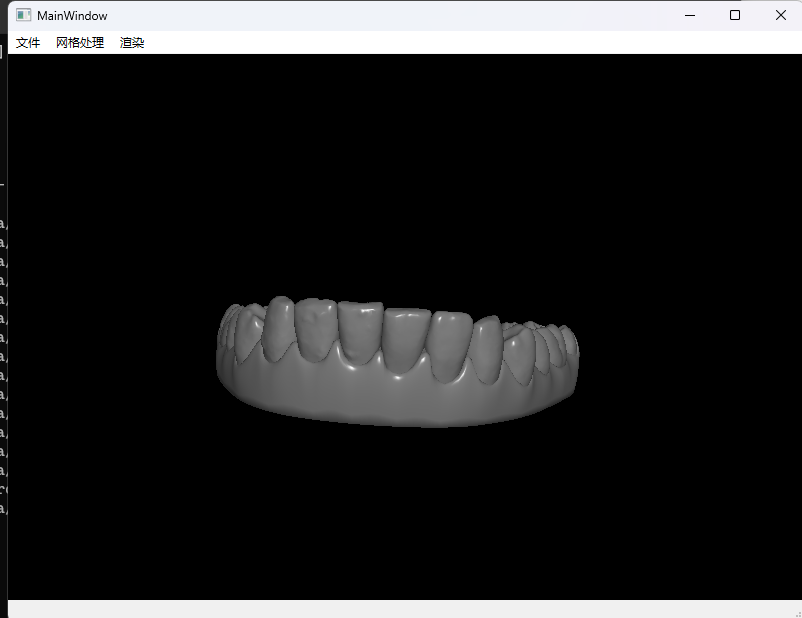
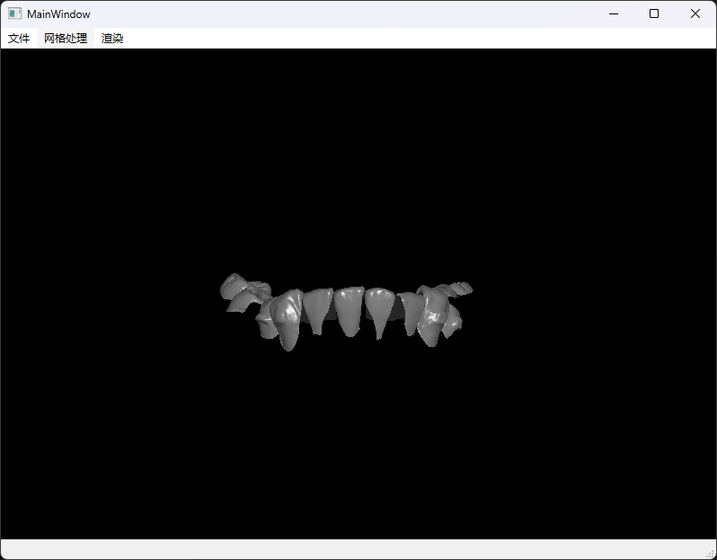
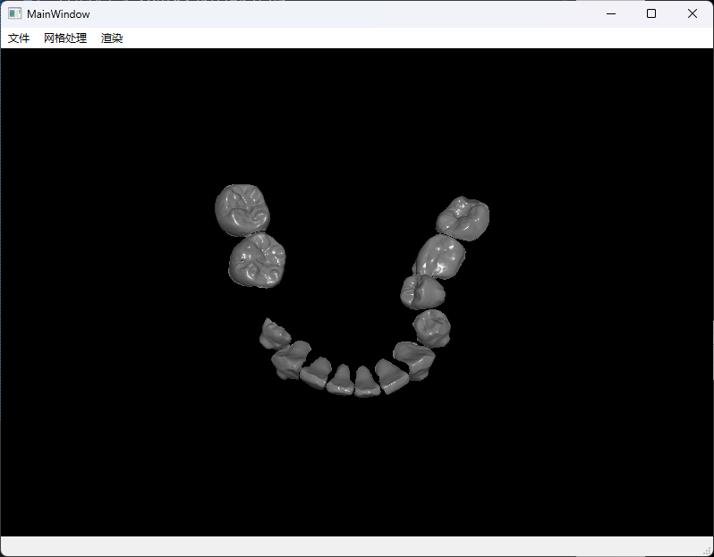
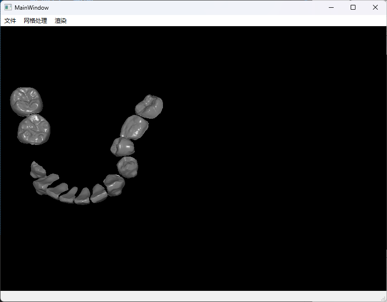

# Cart3DDemo
---
## 项目说明
这是一个Cart3DDemo,这是作为测试使用的demo,用来测试Cart3D算法库和QtOpenGL结合的测试项目。

## 实现功能
**目前实现的功能：**
1. 可以一次性加载多个模型也可以加载一个模型，并实现了相应的渲染功能。
2. 有病例可以测试切割的算法
3. 实现了一部分的鼠标交互功能

## 功能展示截图
1. 下图中的模型中,牙齿是多个模型加载,牙龈是单个模型加载

2. 下图中展示的是切割算法的测试,将牙龈和牙齿进行分割

3. 鼠标交互展示
鼠标左键调整模型视角

鼠标中键平移模型

