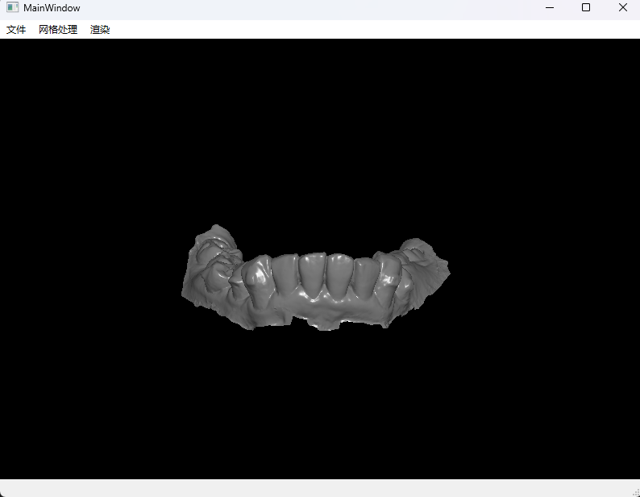

# Cart3DDemo
---
## 项目说明
这是一个Cart3DDemo,这是作为测试使用的demo,用来测试Cart3D算法库和QtOpenGL结合的测试项目。

## 一些问题
目前因为封装了渲染模块的东西，交互的东西目前还没有重写，所以三维交互可能纯在一定的问题。
渲染模块的测试代码例子具体代码在文件夹**view\\foxopenGLwidget.cpp**的
**FoxOpenGLWidget::openMeshFilePath** 槽函数中
```c++
// 以下是必要的头文件
#include "../rendering/foxactor.h"
#include "../rendering/foxpolydata.h"
#include "../rendering/foxopenglpolydatamapper.h"
#include "../rendering/foxrenderer.h"
void FoxOpenGLWidget::openMeshFilePath(const QString& upper, const QString& lower)
{
    // 下面介绍一下渲染的数据加载流程
    makeCurrent();
    Cart3D::OpenTriMesh mesh;
    // 通过openmesh 读取网格数据
    IO::read_mesh(mesh, fileName);
    // 使用polydata将mesh数据转化为顶点数据
    std::shared_ptr<FoxPolyData> polydata = std::make_shared<FoxPolyData>(mesh);
    // 再将polydata顶点数据交给mapper
    // mapper中将数据添加至VBO中
    std::shared_ptr<FoxOpenGLPolyDataMapper> mapper = std::make_shared<FoxOpenGLPolyDataMapper>();
    mapper->setPolyData(polydata);
    // 在Actor中对最后渲染做矩阵变换 同时还可以设置颜色等属性
    std::shared_ptr<FoxActor> actor = std::make_shared<FoxActor>(this);
    actor->setPolyDataMapper(mapper);
    // 设置模型为红色
    actor->setColor(1.0f, 0.0f, 0.0f);
    // 最后将actor添加至渲染器类中
    m_renderer->addActor(actor);
    update();
}

void FoxOpenGLWidget::paintGL()
{
    glClearColor(0.85f, 0.85f, 0.85f, 1.0f);
    glClear(GL_COLOR_BUFFER_BIT | GL_DEPTH_BUFFER_BIT);
    //Z缓冲(Z-buffer)，也被称为深度缓冲(Depth Buffer)
    glEnable(GL_DEPTH_TEST); //默认关闭的
    // 在QOpenGlWidegt的绘制函数中
    // 只需要调用renderer 就可以将所有的actor绘制出来
    m_renderer->renderer();
}


 ```

## 渲染的运行结果
下面是通过使用我渲染的渲染模块加载出来的两个不同颜色的模型


显示小球和边界线的运行效果, 边界线收到小球的颜色影响
因为线条没有像顶点那样可以确定法线所以看起来可能会有点奇怪


## 实现功能
**目前实现的功能：**
1. 可以一次性加载多个模型也可以加载一个模型，并实现了相应的渲染功能。
2. 有病例可以测试切割的算法
3. 实现了一部分的鼠标交互功能


## 功能展示截图
1. 下图中的模型中,牙齿是多个模型加载,牙龈是单个模型加载


2. 下图中展示的是切割算法的测试,将牙龈和牙齿进行分割



3. 鼠标交互展示
鼠标左键调整模型视角

鼠标中键平移模型


